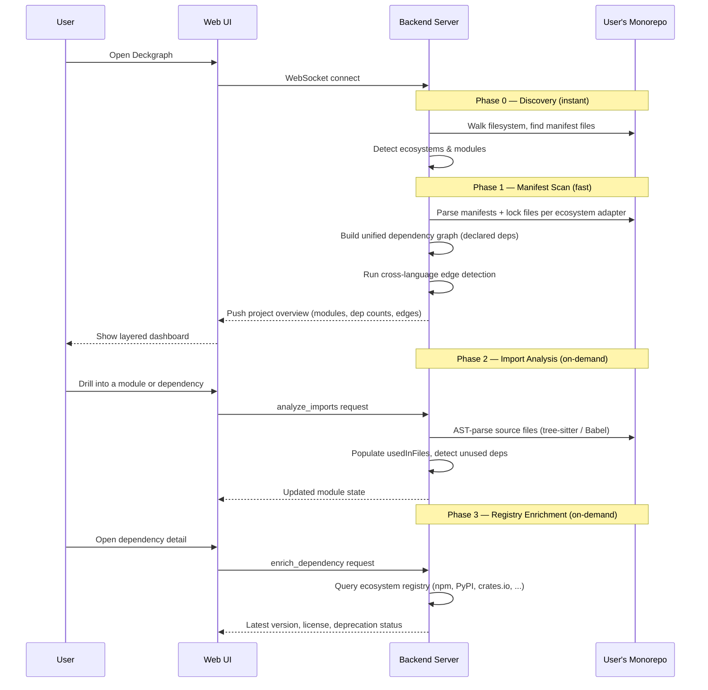
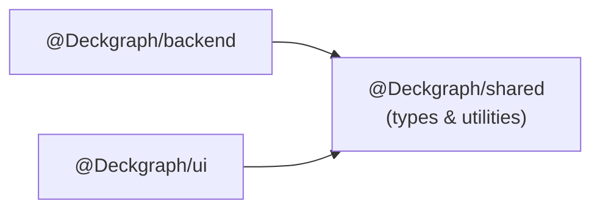
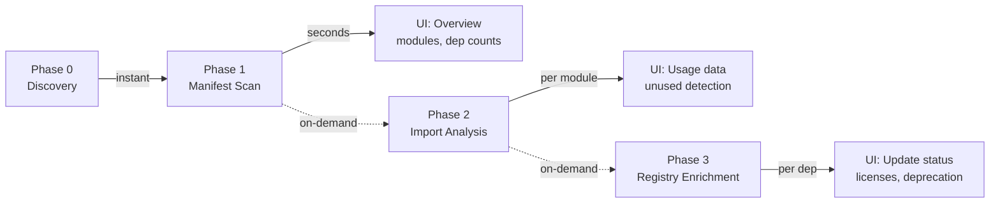

# Architecture

Deckgraph is a **multi-language dependency exploration and audit tool** for large codebases. It scans a monorepo, auto-detects modules across ecosystems (JS/TS, Python, Go, Rust, Java), builds a unified dependency graph with cross-language edges, and presents layered, filterable views through an interactive web interface.

## Design Principles

| Principle | Description |
|-----------|-------------|
| **Anti-hairball** | Every view is filtered, layered, and zoomable — never dump the full graph |
| **Lazy analysis** | Fast manifest scan upfront; expensive AST import analysis on-demand |
| **Ecosystem-agnostic core** | Adapters normalize every ecosystem into one unified model |
| **Cross-language aware** | Track dependencies across language boundaries (Proto, FFI, OpenAPI, build, config) |
| **Monorepo-first** | Single root, auto-discover modules. Polyrepo = multiple roots behind the same interface |

## Architecture Diagram

```
┌──────────────────────────────────────────────────────────────────┐
│                          Web UI (React)                          │
│                                                                  │
│  ┌────────┐ ┌────────┐ ┌──────────┐ ┌──────────┐ ┌───────────┐ │
│  │Overview│ │Ecosys. │ │ Module   │ │ Concern  │ │  Cross-   │ │
│  │  View  │ │ View   │ │  View    │ │  View    │ │  Lang     │ │
│  └────────┘ └────────┘ └──────────┘ └──────────┘ └───────────┘ │
└──────────────────────┬───────────────────────────────────────────┘
                       │ WebSocket
┌──────────────────────▼───────────────────────────────────────────┐
│                       Backend (Node.js)                          │
│                                                                  │
│  ┌─────────────────────────────────────────────────────────────┐ │
│  │                    Query Engine                             │ │
│  │  filter(ecosystem, module, depth, concern, ...) → View      │ │
│  └──────────────────────┬──────────────────────────────────────┘ │
│                         │                                        │
│  ┌──────────────────────▼──────────────────────────────────────┐ │
│  │               Unified Dependency Graph                      │ │
│  │  Nodes: Module | Dependency                                 │ │
│  │  Edges: depends-on | imports | cross-lang                   │ │
│  └──────────────────────┬──────────────────────────────────────┘ │
│                         │                                        │
│  ┌──────────┬───────────┼───────────┬───────────┬────────────┐   │
│  │  JS/TS   │  Python   │    Go     │   Rust    │    Java    │   │
│  │ Adapter  │ Adapter   │  Adapter  │  Adapter  │  Adapter   │   │
│  └──────────┴───────────┴───────────┴───────────┴────────────┘   │
│                                                                  │
│  ┌─────────────────────────────────────────────────────────────┐ │
│  │              Cross-Language Edge Detector                   │ │
│  │  Proto/gRPC │ OpenAPI │ FFI │ Build refs │ Shared config    │ │
│  └─────────────────────────────────────────────────────────────┘ │
└──────────────────────────────────────────────────────────────────┘
```

Two tiers. One backend process. No MCP protocol, no LLM, no stdio transport.

## Data Flow



## Package Structure

```
packages/
├── backend/       # Node.js server (scanner, adapters, graph, query engine, WS server)
├── ui/            # Web frontend (React 19 + Vite + shadcn/ui)
└── shared/        # Shared types & utilities (sole cross-package dependency)
```

## Package Dependency Graph



`@Deckgraph/shared` is the only cross-package dependency. UI never imports from backend directly.

## Tech Stack

| Layer | Technology | Rationale |
|-------|-----------|-----------|
| Monorepo | pnpm + Turborepo | Fast builds, efficient for multi-package repos |
| Backend runtime | Node.js + TypeScript | Strong typing, ecosystem tooling |
| Validation | Zod | Schema validation for all external data |
| AST parsing (JS/TS) | `@babel/parser` | Pure JS, zero native deps, battle-tested for JS/TS |
| AST parsing (multi-lang) | web-tree-sitter (WASM) | Zero native deps, one framework, 5 grammars. See [ADR-003](./adr/003-tree-sitter-unified-parser.md) |
| Logging | `pino` | Fast, JSON-based structured logging |
| File watching | chokidar | Reliable cross-platform file watching |
| WebSocket | `ws` (server-side) | Bidirectional real-time communication |
| Frontend | React 19 + Vite + shadcn/ui | Modern, fast, beautiful out of box |
| State | Zustand | Lightweight, minimal boilerplate. See [ADR-002](./adr/002-zustand-over-redux.md) |
| Styling | Tailwind CSS v4 (via shadcn) | Rapid UI development |
| Distribution | npm (`npx Deckgraph`) | Easy install for users |
| Fuzzy search | `fuse.js` | Lightweight client-side fuzzy matching |

## Project Structure

```
Deckgraph/
├── packages/
│   ├── backend/                             # Backend server
│   │   └── src/
│   │       ├── index.ts                    # Entry: starts WS server, initializes scanner
│   │       ├── discovery/
│   │       │   ├── moduleDiscovery.ts      # Walk filesystem, detect modules by manifest files
│   │       │   └── ecosystemDetector.ts    # Determine ecosystem from manifest presence
│   │       ├── adapters/                    # Pluggable ecosystem adapters
│   │       │   ├── types.ts                # EcosystemAdapter, ManifestResult, ParsedImport
│   │       │   ├── registry.ts             # AdapterRegistry implementation
│   │       │   ├── javascript/
│   │       │   │   ├── manifestParser.ts   # package.json + lock file parsing
│   │       │   │   ├── importAnalyzer.ts   # @babel/parser-based AST import extraction
│   │       │   │   └── registryClient.ts   # npm API client
│   │       │   ├── python/
│   │       │   │   ├── manifestParser.ts   # pyproject.toml, requirements.txt, Pipfile
│   │       │   │   ├── importAnalyzer.ts   # tree-sitter-python AST import extraction
│   │       │   │   └── registryClient.ts   # PyPI JSON API client
│   │       │   ├── go/
│   │       │   │   ├── manifestParser.ts   # go.mod, go.sum
│   │       │   │   ├── importAnalyzer.ts   # tree-sitter-go import extraction
│   │       │   │   └── registryClient.ts   # Go proxy API client
│   │       │   ├── rust/
│   │       │   │   ├── manifestParser.ts   # Cargo.toml, Cargo.lock
│   │       │   │   ├── importAnalyzer.ts   # tree-sitter-rust use/extern crate extraction
│   │       │   │   └── registryClient.ts   # crates.io API client
│   │       │   ├── java/
│   │       │   │   ├── manifestParser.ts   # pom.xml, build.gradle(.kts)
│   │       │   │   ├── importAnalyzer.ts   # tree-sitter-java import extraction
│   │       │   │   └── registryClient.ts   # Maven Central API client
│   │       │   └── index.ts                # Creates registry, registers all adapters
│   │       ├── graph/
│   │       │   ├── dependencyGraph.ts      # Unified DAG: modules + deps + cross-lang edges
│   │       │   ├── queryEngine.ts          # ViewQuery → ViewResult filtering
│   │       │   └── cycleDetector.ts        # Kahn's algorithm for cycle detection
│   │       ├── crosslang/
│   │       │   ├── types.ts                # CrossEdge, EdgeDetector interface
│   │       │   ├── protoDetector.ts        # Proto/gRPC edge detection
│   │       │   ├── openapiDetector.ts      # OpenAPI spec → generated client detection
│   │       │   ├── ffiDetector.ts          # PyO3, cgo, JNI, napi pattern detection
│   │       │   ├── buildRefDetector.ts     # docker-compose, Makefile cross-module refs
│   │       │   ├── sharedConfigDetector.ts # Shared env vars and config files
│   │       │   └── index.ts                # Runs all detectors, aggregates edges
│   │       ├── concern/
│   │       │   ├── tagDatabase.ts          # Built-in package → concern tag mapping
│   │       │   └── tagger.ts              # Tag resolution: built-in + user overrides
│   │       ├── analysis/
│   │       │   ├── outdated.ts             # Compare installed vs latest (per-ecosystem)
│   │       │   └── unused.ts              # Declared deps not found in import analysis
│   │       ├── ws/
│   │       │   ├── server.ts              # WebSocket server for UI
│   │       │   └── protocol.ts            # Message types & handlers
│   │       └── watcher/
│   │           └── fileWatcher.ts          # chokidar-based incremental re-scan
│   │
│   ├── ui/                                  # Web frontend
│   │   └── src/
│   │       ├── App.tsx
│   │       ├── main.tsx
│   │       ├── components/
│   │       │   ├── layout/                 # Sidebar, Header, Shell
│   │       │   ├── overview/               # ProjectOverview, EcosystemCards, HealthSummary
│   │       │   ├── explorer/               # ModuleList, DependencyList, DependencyTree
│   │       │   ├── detail/                 # DependencyDetail, UsageList, TransitiveTree
│   │       │   ├── crosslang/              # CrossLanguageGraph, EdgeList, EdgeDetail
│   │       │   ├── filters/                # EcosystemFilter, ScopeFilter, ConcernFilter, DepthSlider
│   │       │   └── health/                 # OutdatedReport, UnusedReport, LicenseAudit
│   │       ├── hooks/                      # useProject, useModule, useViewQuery
│   │       ├── stores/                     # Zustand: projectStore, viewStore, filterStore
│   │       └── lib/                        # ws-client.ts, types.ts
│   │
│   └── shared/                              # Shared types & utilities
│       └── src/
│           ├── types/
│           │   ├── project.ts              # Project, Module, Dependency, CrossEdge
│           │   ├── adapters.ts             # EcosystemAdapter, ManifestResult, ParsedImport
│           │   ├── views.ts                # ViewQuery, ViewResult, ViewSummary
│           │   ├── messages.ts             # WebSocket message protocol
│           │   └── registry.ts             # RegistryMeta (ecosystem-agnostic)
│           └── index.ts
│
├── .Deckgraph.yaml                            # Project-level config (concern tag overrides, ignored paths)
├── turbo.json
├── pnpm-workspace.yaml
├── package.json
└── README.md
```

## State Architecture

```mermaid
flowchart LR
    Backend["Backend\n(source of truth)"]
    PS["projectStore"]
    VS["viewStore"]
    FS["filterStore"]

    Backend -->|"push state"| PS
    Backend -->|"push results"| VS

    PS -.--->|"read-only cache"| UI["UI Components"]
    VS -.--->|"read-only cache"| UI
    FS -.--->|"local filters"| UI
```

- **Backend is the source of truth** for all project and dependency state
- UI Zustand stores are caches of server-pushed state
- `filterStore` is local — filter changes don't require server round-trips for already-loaded data
- No optimistic updates — UI waits for server confirmation
- On reconnect, UI sends `sync` to receive full state

## Core Backend Modules

### Discovery

Walks the filesystem from the project root, identifies modules by the presence of manifest files (`package.json`, `pyproject.toml`, `go.mod`, `Cargo.toml`, `pom.xml`/`build.gradle`). Determines ecosystem per module.

### Adapter System

Strategy Pattern with `EcosystemAdapter` interface. Each adapter bundles three capabilities: manifest parsing, import analysis, and registry queries. All adapters register with the `AdapterRegistry` — scanner code never references a specific adapter directly.

See [ADR-003](./adr/003-tree-sitter-unified-parser.md) for the parser technology choices.
See [Adapter Schema](./schemas/adapters.md) for the full interface definition and per-ecosystem details.

### Unified Dependency Graph

In-memory DAG with three node types (modules, dependencies, cross-language edges) represented as adjacency lists. Supports:
- Forward traversal (what does X depend on?)
- Reverse traversal (what depends on X?)
- Cross-language edge traversal (what modules in other ecosystems connect to X?)
- Cycle detection via Kahn's algorithm
- Incremental updates when files change

### Query Engine

Translates `ViewQuery` objects (ecosystem filter, module filter, depth, concern tags, search) into `ViewResult` objects that the UI renders. The UI never sees the raw graph — every view is a filtered projection.

See [View Schema](./schemas/views.md) for query/result types.

### Cross-Language Edge Detector

Five independent detectors that each produce `CrossEdge` objects with a `type` and `confidence` score:

| Detector | Finds | Confidence | Default |
|----------|-------|------------|---------|
| Proto/gRPC | RPC service contracts via `.proto` files | High (0.9+) | Shown |
| FFI | Native bindings (PyO3, cgo, JNI, napi) | High (0.9+) | Shown |
| OpenAPI | REST contracts via `openapi.yaml` / `swagger.json` | Medium (0.7) | Shown |
| Build refs | Deployment relationships via `docker-compose.yml`, `Makefile` | Low (0.4) | Hidden |
| Shared config | Configuration coupling via shared env vars | Low (0.3) | Hidden |

Low-confidence edge types are hidden by default in the UI but togglable by the user.

### Concern Tagger

Maps dependencies to concern tags (`http`, `database`, `auth`, `logging`, etc.) using a **built-in curated database** of well-known packages across all ecosystems. User overrides via `.Deckgraph.yaml`. No automated classification.

### File Watcher

chokidar-based watcher that triggers incremental re-scans. Content hashing (xxhash) to skip unchanged files. Re-runs only the affected adapter(s) and cross-language detectors.

## Lazy Analysis Pipeline



| Phase | What | Speed | Trigger |
|-------|------|-------|---------|
| **0: Discovery** | Walk filesystem, detect modules and ecosystems | Instant | Startup |
| **1: Manifest Scan** | Parse manifests + lock files → declared deps | Seconds | Startup |
| **2: Import Analysis** | AST-parse source files → `usedInFiles`, unused detection | Per module | User drills into module |
| **3: Registry Enrichment** | Query registry APIs → latest versions, licenses | Per dependency | User opens dep detail |

See [ADR-004](./adr/004-lazy-analysis-pipeline.md) for the rationale.

## Security Model

- **Localhost-only binding:** WS server bound to `127.0.0.1` only, no auth in Phase 1. Auth deferred until remote access is needed
- **CORS:** WS server only accepts connections from the deployed UI domain + localhost
- **No secrets stored:** Deckgraph never handles API keys or credentials
- **Read-only MVP:** Backend only reads the filesystem. No package management actions in v1

## Error Handling

All errors surfaced to the UI follow this format:

```typescript
{
  type: "error",
  message: string,    // Plain-language: "what happened"
  suggestion: string  // Plain-language: "what to do about it"
}
```

Never expose stack traces or technical jargon in user-facing messages. Use `pino` for server-side logging. Never log secrets.

---

## Related Links

- [ADR-001: Babel over tree-sitter (Superseded)](./adr/001-babel-over-treesitter.md)
- [ADR-002: Zustand over Redux](./adr/002-zustand-over-redux.md)
- [ADR-003: tree-sitter as unified parser](./adr/003-tree-sitter-unified-parser.md)
- [ADR-004: Lazy analysis pipeline](./adr/004-lazy-analysis-pipeline.md)
- [Project Schema](./schemas/project.md)
- [Adapter Schema](./schemas/adapters.md)
- [View Schema](./schemas/views.md)
- [Archived docs](./archive/) — Previous architectures (prompt co-pilot, JS-only dependency UI)
