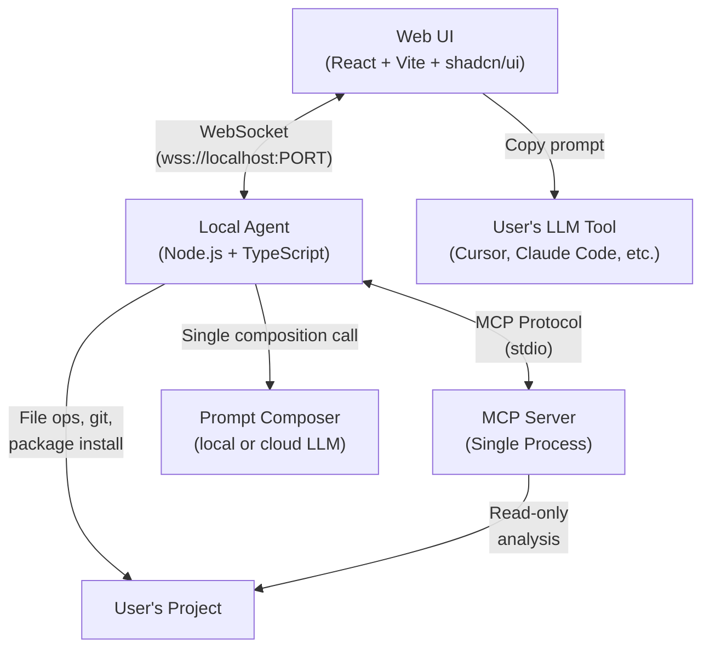
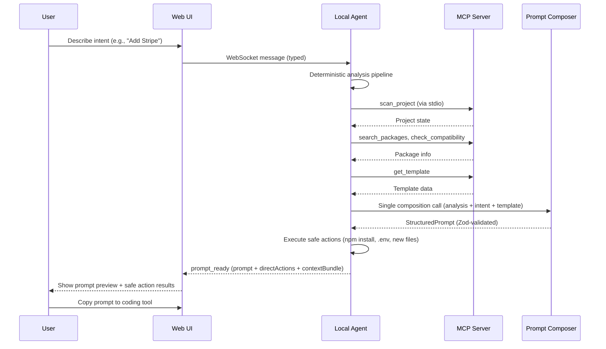
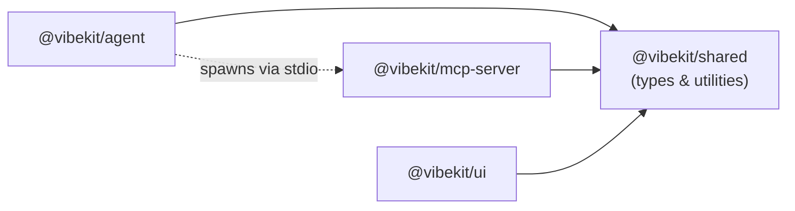
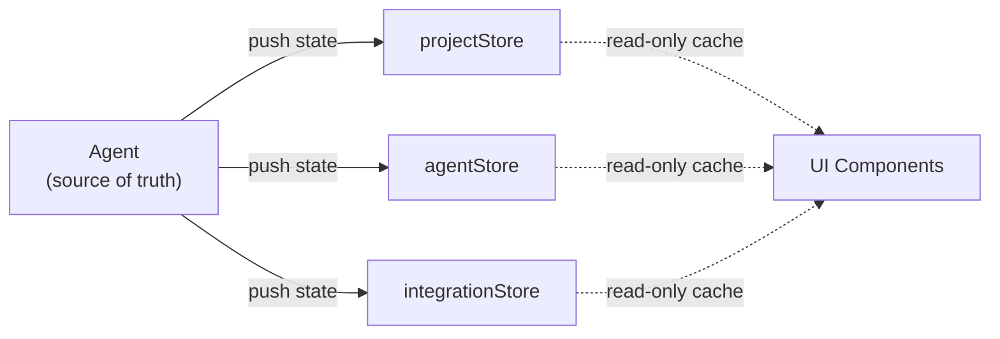

# Architecture

Vibe coders frequently hit walls when integrating third-party services: error messages are cryptic, dependency conflicts are confusing, and wiring up services requires knowledge they don't have. Vibekit solves this as a **prompt generation co-pilot**: a three-tier system where a **Web UI** communicates over WebSocket with a **Local Agent**, which orchestrates an **MCP Server** via stdio. The agent runs a deterministic analysis pipeline to understand the user's project, then uses a lightweight LLM to compose structured prompts that users copy into their own coding tools (Cursor, Claude Code, Copilot, etc.). Safe actions like package installs and .env updates execute directly.

## Architecture Diagram



## Data Flow



1. User describes intent in the Web UI (e.g., "Add Stripe with a checkout button")
2. UI sends typed messages over WebSocket to Local Agent
3. Agent runs a **deterministic analysis pipeline** — calling MCP tools in a fixed order (scan, search, check compatibility, fetch template)
4. Agent sends analysis results + user intent to the **Prompt Composer** (a single LLM call, not multi-turn reasoning)
5. LLM output is **Zod-validated** — retry on failure, fall back to template-only prompt after 3 failures
6. Safe actions (npm install, .env updates, new files from templates) execute directly with git snapshots
7. Complex changes become a **structured prompt** that the user copies into their LLM coding tool

## Package Dependency Graph



`@vibekit/shared` is the **only** cross-package dependency. UI never imports from agent or MCP server directly.

## Tech Stack

| Layer | Technology | Rationale |
|-------|-----------|-----------|
| Monorepo | pnpm + Turborepo | Fast builds, efficient for multi-package repos |
| Agent runtime | Node.js + TypeScript | Same ecosystem as MCP SDK, strong typing |
| LLM | Configurable (local default + cloud providers) | Lightweight composition, not autonomous reasoning |
| Validation | Zod | Schema validation for all LLM output |
| MCP | `@modelcontextprotocol/sdk` | Official SDK for both client and server |
| AST parsing | `@babel/parser` (v1) | Pure JS AST parsing for JS/TS, zero native deps, pluggable architecture for future language support |
| Logging | `pino` | Fast, JSON-based structured logging, configurable log levels |
| File watching | chokidar | Reliable cross-platform file watching |
| WebSocket | `ws` (server-side) | Simple, fast, bidirectional comms |
| Frontend | React 19 + Vite + shadcn/ui | Modern, fast, beautiful out of box |
| State | Zustand | Lightweight, minimal boilerplate |
| Styling | Tailwind CSS v4 (via shadcn) | Rapid UI development |
| UI hosting | Vercel | Zero-config deployment |
| Agent distribution | npm (`npx vibekit`) | Easy install for users |

## Project Structure

```
vibekit/
├── packages/
│   ├── agent/                          # Local agent process
│   │   └── src/
│   │       ├── index.ts                # Entry: starts WS server + MCP client
│   │       ├── agent/
│   │       │   ├── pipeline.ts         # Deterministic analysis pipeline
│   │       │   ├── promptComposer.ts   # LLM-based prompt composition
│   │       │   └── executor.ts         # Executes safe actions only
│   │       ├── llm/
│   │       │   ├── provider.ts         # LLM provider abstraction (local/cloud)
│   │       │   └── validator.ts        # Zod validation for LLM output
│   │       ├── prompt/
│   │       │   ├── builder.ts          # Assembles StructuredPrompt from sections
│   │       │   └── contextBundle.ts    # Selects and bundles relevant project files
│   │       ├── mcp/
│   │       │   ├── client.ts           # MCP client manager (spawns server)
│   │       │   └── config.ts           # Server configuration
│   │       ├── ws/
│   │       │   ├── server.ts           # WebSocket server for UI
│   │       │   ├── protocol.ts         # Message types & handlers
│   │       │   └── auth.ts             # Connection auth (local token)
│   │       ├── actions/
│   │       │   ├── install.ts          # Package install/remove
│   │       │   ├── config.ts           # .env and config file mgmt
│   │       │   └── snapshot.ts         # Git-based snapshots & rollback
│   │       └── project/
│   │           ├── context.ts          # Cached project understanding
│   │           └── watcher.ts          # File change detection
│   │
│   ├── mcp-server/                     # Single MCP server
│   │   └── src/
│   │       ├── index.ts                # Server entry, tool registration
│   │       ├── tools/
│   │       │   ├── codebase/           # scan_project, detect_framework, find_integrations, dependency_graph
│   │       │   ├── registry/           # search_packages, get_package_info, check_compatibility, check_vulnerabilities
│   │       │   ├── docs/               # fetch_docs, get_examples, search_guides
│   │       │   └── templates/          # list_templates, get_template, apply_template
│   │       ├── parsers/                # Pluggable language parser system
│   │       │   ├── types.ts            # LanguageParser, ParsedImport, DetectedPattern, FileStructure
│   │       │   ├── registry.ts         # ParserRegistry implementation
│   │       │   ├── babelParser.ts      # v1: JS/TS via @babel/parser
│   │       │   └── index.ts            # Creates registry, registers v1 parsers, exports
│   │       ├── registries/             # npm.ts, pypi.ts
│   │       ├── templates/              # Curated template library
│   │       │   ├── payments/stripe/
│   │       │   ├── auth/{auth0,clerk,firebase-auth}/
│   │       │   ├── database/{supabase,prisma,mongodb}/
│   │       │   └── storage/{s3,cloudinary}/
│   │       └── cache.ts
│   │
│   ├── ui/                             # Web frontend
│   │   └── src/
│   │       ├── App.tsx
│   │       ├── main.tsx
│   │       ├── components/
│   │       │   ├── layout/             # Sidebar, Header, Shell
│   │       │   ├── dashboard/          # ProjectHealth, ActiveIntegrations, QuickActions
│   │       │   ├── marketplace/        # IntegrationCard, CategoryFilter, SearchBar
│   │       │   ├── wizard/             # StepIndicator, ConfigForm, PromptPreview, CopyTargetSelector
│   │       │   ├── prompt/             # PromptPreview, CopyTargetSelector, PromptRefinement
│   │       │   ├── deps/              # DependencyList, DependencyCard, ConflictResolver
│   │       │   ├── timeline/           # ActivityFeed, UndoButton
│   │       │   └── chat/              # PromptChat, MessageBubble
│   │       ├── hooks/                  # useAgent, useProject, usePromptReview
│   │       ├── stores/                 # Zustand: projectStore, agentStore, integrationStore, promptStore
│   │       └── lib/                    # ws-client.ts, types.ts
│   │
│   └── shared/                         # Shared types & utilities
│       └── src/
│           ├── types/
│           │   ├── messages.ts         # WebSocket message protocol (ClientMessage, ServerMessage)
│           │   ├── integration.ts      # Integration types
│           │   ├── project.ts          # Project types
│           │   └── prompt.ts           # StructuredPrompt, ContextBundle, PromptSection
│           └── index.ts
│
├── turbo.json
├── pnpm-workspace.yaml
├── package.json
└── README.md
```

## State Architecture



- **Agent is the source of truth** for all project state
- UI Zustand stores are **caches of server-pushed state**, not independent sources of truth
- **No optimistic updates** — UI waits for server confirmation before reflecting changes
- On reconnect, UI sends `{ type: "sync" }` to receive full state

### Zustand Store Responsibilities

| Store | Data |
|-------|------|
| `projectStore` | Project metadata, framework info, health status |
| `agentStore` | Connection status, pipeline progress, pending approvals |
| `integrationStore` | Active integrations, marketplace catalog, wizard state |
| `promptStore` | Current prompt, refinement history, copy targets |

## Security Model

- **API keys optional:** Local LLM runs by default — zero API keys needed. Cloud providers are opt-in
- **LLM calls stay local:** When using a local model, no data leaves the user's machine
- **Auth token:** Agent generates a random token on startup; UI must present it to connect
- **Git snapshots:** Every mutation creates a git commit/stash for rollback
- **Secret detection:** Agent refuses to commit `.env` files or expose keys in generated code
- **Prompt safety:** Generated prompts never include API keys or secrets — only placeholder references
- **CORS:** Agent's WS server only accepts connections from the deployed UI domain + localhost

For general security rules, see `.claude/rules/security.md`.

## Open Core Boundary

| Feature | Free (MIT) | Premium |
|---------|-----------|---------|
| Agent + MCP server | Full | Full |
| Core UI (Dashboard, Deps, Wizard) | Yes | Yes |
| Community templates (top 20) | Yes | Yes |
| Single project | Yes | Yes |
| Visual dependency graph | - | Yes |
| Enterprise templates (SAML, LDAP) | - | Yes |
| Multi-project management | - | Yes |
| Team features | - | Yes |
| Priority support | - | Yes |
| Hosted agent option | - | Yes |

Premium features should be gated with feature flags, not deeply interleaved logic.

## Error Handling Philosophy

**Internal (agent-side):**
- MCP server crash/timeout: restart process, retry once, then surface error
- LLM composition failure: retry with Zod error context (max 2 retries), then fall back to template-only prompt
- LLM output validation failure: send Zod errors back to LLM for correction, fall back to template-only after 3 total failures
- WebSocket disconnect: agent continues, queues updates, replays on reconnect

**User-facing:** All errors follow this format (never stack traces or technical jargon):

```typescript
{
  type: "error",
  message: string,    // Plain-language: "what happened"
  suggestion: string  // Plain-language: "what to do about it"
}
```

**Logging:** `pino` for all logging. Levels: `error`, `warn`, `info`, `debug`. Default `info` in production, `debug` in dev. Never log secrets or API keys.

---

## Related Links

- [Agent Spec](./spec/agent.md) | [Prompt Pipeline Spec](./spec/prompt-pipeline.md) | [MCP Server Spec](./spec/mcp-server.md) | [UI Spec](./spec/ui.md)
- [WebSocket API](./api/websocket.md) | [MCP Tools API](./api/mcp-tools.md) | [CLI Reference](./api/cli.md)
- [Schemas](./schemas/) | [ADRs](./adr/)
