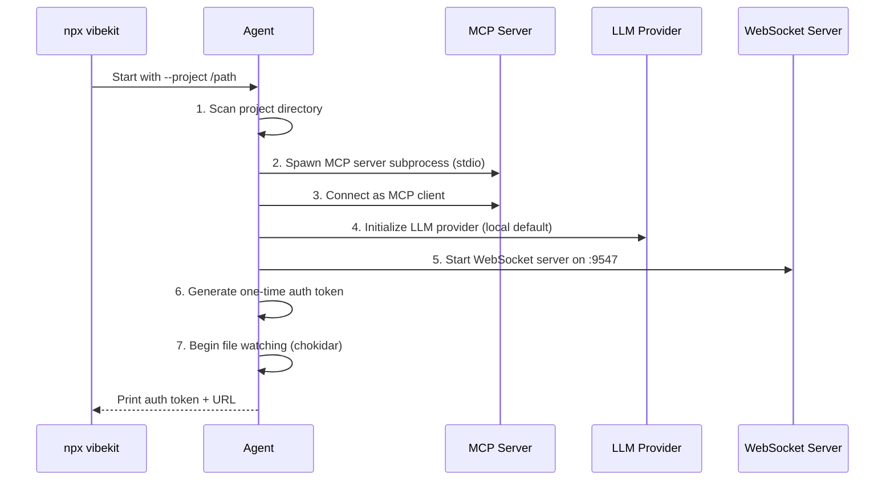
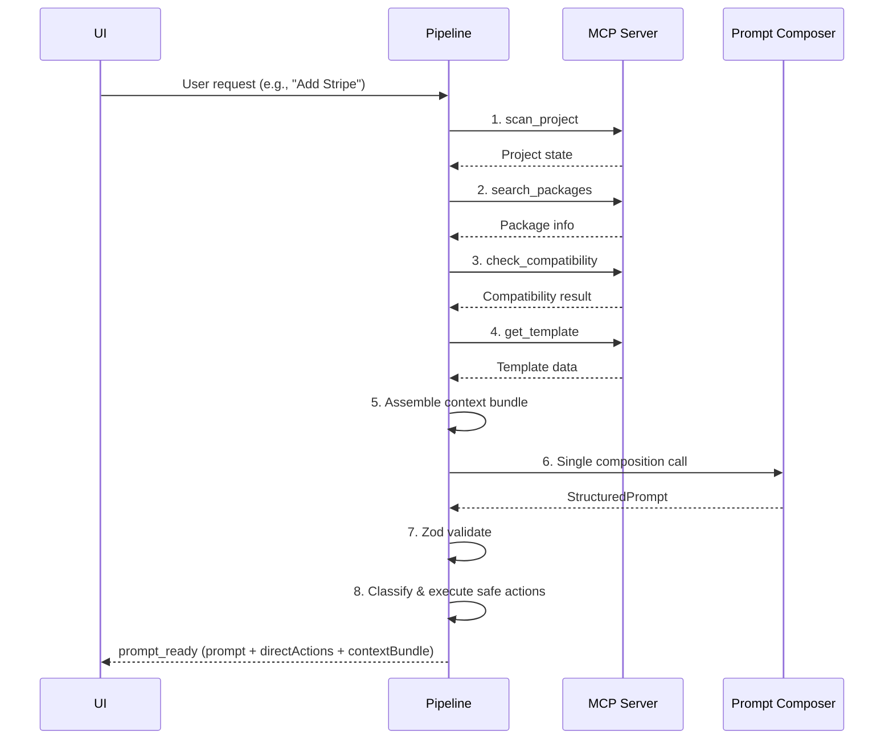
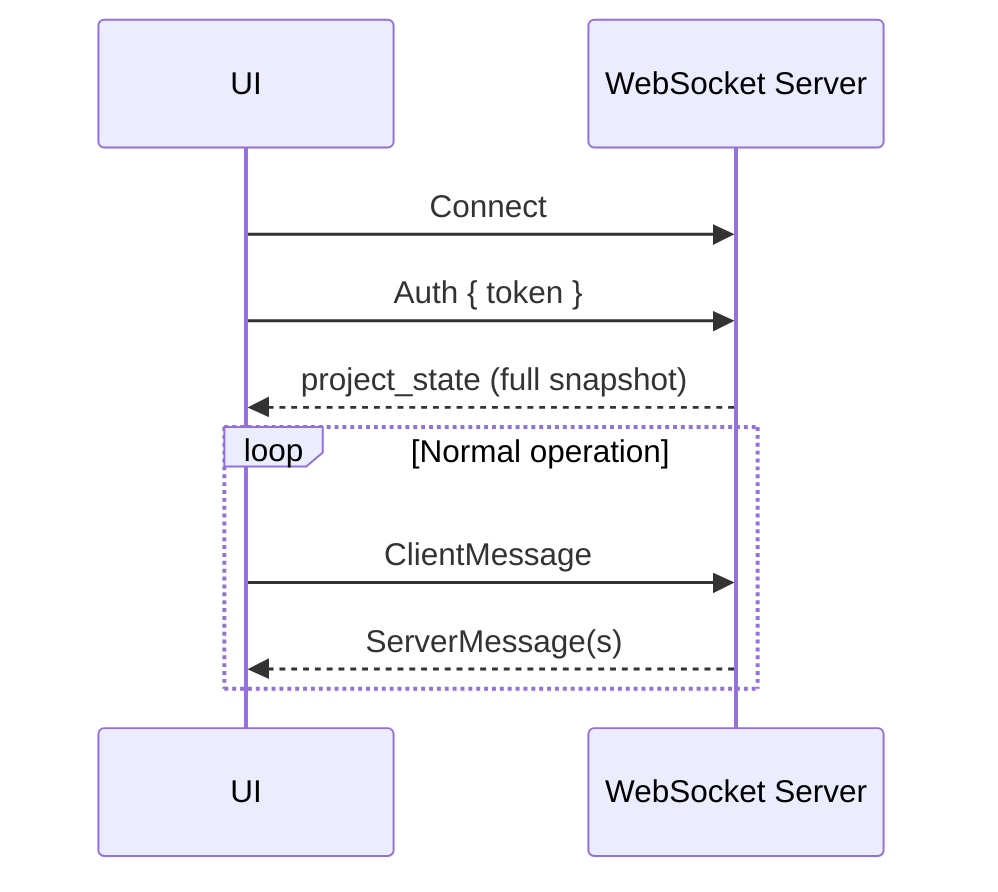

# Agent Specification

The Local Agent is the core runtime of Vibekit. It runs a deterministic analysis pipeline, composes structured prompts via a lightweight LLM, executes safe actions directly, and serves the WebSocket API for the UI.

## Overview

- **Package:** `@vibekit/agent`
- **Distribution:** npm (`npx vibekit` or `npm install -g vibekit`)
- **Runtime:** Node.js + TypeScript
- **Responsibilities:** Deterministic project analysis, prompt composition, safe action execution, git snapshots

## Startup Sequence



1. **Scan project directory** — Quick framework detection to prime the cache
2. **Spawn MCP server subprocess** — Single process via stdio transport
3. **Connect to MCP server as a client** — Verify tool registration
4. **Initialize LLM provider** — Load configured provider (local by default, no API keys needed)
5. **Start WebSocket server** on `localhost:9547` (configurable via `--port`)
6. **Generate a one-time auth token** — Print it + URL to terminal
7. **Begin file watching** — chokidar watches for project changes

## Analysis Pipeline

The pipeline runs deterministic tool calls to gather project context. No LLM decides which tools to call — the order is fixed and algorithmic.



**Key behaviors:**
- Pipeline calls MCP tools **deterministically**, not via LLM tool-use
- Each tool call produces data that feeds into the next step
- The pipeline streams `agent_thinking` messages to the UI during processing (e.g., "Scanning project...", "Checking compatibility...")
- After analysis, the pipeline sends all context to the Prompt Composer for a **single LLM call**
- Safe actions are identified and executed directly; complex changes become the structured prompt

**Source:** `packages/agent/src/agent/pipeline.ts`

### Example: Stripe Integration Flow

A concrete example of the deterministic pipeline when a user requests "Add Stripe":

```
1. scan_project()              -> Understand codebase (Next.js, existing deps, file structure)
2. search_packages("stripe")   -> Find the right npm package
3. check_compatibility("stripe", "14.x", projectDeps)
                               -> Verify it works with the project's existing dependencies
4. get_template("stripe", "nextjs")
                               -> Get the curated integration template
5. Assemble context bundle     -> Gather relevant files for prompt context
6. Compose prompt (single LLM call)
                               -> Generate StructuredPrompt from analysis + intent + template
7. Zod validate                -> Verify LLM output matches schema
```

After the pipeline completes, the result is a hybrid:

```
{
  directActions: [
    "Install stripe@14.5.0",
    "Add STRIPE_SECRET_KEY to .env.local",
    "Create lib/stripe.ts from template"
  ],
  prompt: {
    content: "## Context\nYou're working on a Next.js 14 app...\n\n## Instructions\n1. Add a webhook route at app/api/webhooks/stripe/route.ts...\n2. Update middleware.ts to exclude the webhook route from auth...",
    sections: [...]
  }
}
```

Safe actions execute directly with git snapshots. The structured prompt is presented for the user to copy into their coding tool.

## Prompt Composer

Composes a structured prompt from analysis results. This is a **single LLM call**, not multi-turn reasoning.

**Inputs:**
- Analysis results (scan, packages, compatibility, template)
- User intent (natural language)
- Context bundle (relevant project files)
- System prompt (composition instructions)

**Output:** `StructuredPrompt` (Zod-validated)

**Validation loop:**
1. Call LLM with analysis context
2. Parse output with `StructuredPromptSchema.safeParse()`
3. On validation failure: retry with Zod error messages (max 2 retries)
4. After 3 total failures: fall back to template-only prompt (no LLM composition)

See [Prompt Pipeline Spec](./prompt-pipeline.md) for the full pipeline specification.

**Source:** `packages/agent/src/agent/promptComposer.ts`

## Executor

Executes **safe actions only** — actions that can be applied automatically without user review.

**Safe actions:**
- Package install (only if no postinstall scripts)
- Add new keys to `.env.local`
- Create new files from templates (only if target path doesn't already have a file)
- Update lock files (following a safe dependency addition)

**Execution pipeline:**
1. Create git snapshot (non-negotiable)
2. Execute the action
3. Verify the action succeeded
4. Send `action_complete` to UI
5. If action fails: report error, snapshot enables rollback

Complex changes (modify existing files, config changes, deletions) are **not executed** — they become part of the structured prompt.

**Source:** `packages/agent/src/agent/executor.ts`

## Action Engine

### Package Install

- Runs `pnpm add` / `npm install` via child process
- Detects and flags packages with postinstall scripts (classified as complex, goes to prompt)
- Verifies installation by checking `node_modules`

**Source:** `packages/agent/src/actions/install.ts`

### Config Management

- Manages `.env.local` and other config files
- Adds new keys (safe, executes directly)
- Modifying existing keys goes to prompt (complex)
- Never exposes secrets in generated code or commits

**Source:** `packages/agent/src/actions/config.ts`

### Git Snapshots

- Creates a git commit before every mutation
- Commit message format: `vibekit: <action description>`
- Supports rollback to any previous snapshot
- If the project is not a git repo, the agent initializes git (with user confirmation) first

**Source:** `packages/agent/src/actions/snapshot.ts`

## LLM Provider

Configurable LLM provider with local-first default.

**Default:** Local model (e.g., Ollama) — zero API keys needed out of the box.

**Cloud providers (opt-in):**
- Anthropic (Claude)
- OpenAI

**Configuration:**
- `--llm-provider` CLI flag
- `VIBEKIT_LLM_PROVIDER` environment variable
- `vibekit.config.json` `llm` section

**Source:** `packages/agent/src/llm/provider.ts`, `packages/agent/src/llm/validator.ts`

## Project Context

Maintains cached understanding of the project state, updated by file watching.

- Framework detection results
- Dependency list
- Active integrations
- File structure overview

**Source:** `packages/agent/src/project/context.ts`

### File Watching

Uses chokidar to detect changes to the user's project in real-time. On change:
1. Re-analyze affected files via MCP server parser
2. Update cached project context
3. Push updated `project_state` to UI

**Source:** `packages/agent/src/project/watcher.ts`

## MCP Client

Manages the connection to the MCP server subprocess.

- Spawns `@vibekit/mcp-server` as a child process
- Communicates via stdio transport
- On crash: restarts the server, retries the last tool call once, then surfaces error

**Source:** `packages/agent/src/mcp/client.ts`

## WebSocket Server & Protocol

### Connection

- Default port: `9547` (configurable via `--port`)
- Auth: client must send the one-time token in the first message
- Endpoint: `ws://localhost:9547` (upgraded to `wss://` when behind TLS)

### Protocol Requirements

- Every client request includes `requestId: string` (UUID v4)
- Every server response includes the originating `requestId` for correlation
- Streaming updates (`agent_thinking`, progress) reference the `requestId` they relate to
- All messages include `version: 1` for future protocol evolution
- Never send untyped or ad-hoc messages

### Connection Lifecycle



### Heartbeat

- Agent sends `{ type: "ping" }` every 30 seconds
- UI reconnects if no message received within 60 seconds

### Reconnection

- On reconnect, UI sends `{ type: "sync" }` to receive full current state
- Agent replays queued state updates accumulated during disconnect

### Message Types

See [WebSocket API](../api/websocket.md) for the complete reference with JSON examples.

| Direction | Type | Purpose |
|-----------|------|---------|
| Client | `scan_project` | Request project scan |
| Client | `add_integration` | Start integration flow |
| Client | `remove_integration` | Remove an integration |
| Client | `update_dependency` | Update a dependency version |
| Client | `approve_action` | Approve a safe action |
| Client | `rollback` | Roll back to a snapshot |
| Client | `refine_prompt` | Request prompt refinement |
| Client | `copy_prompt` | Log prompt copy event |
| Client | `chat` | Send natural-language message |
| Client | `sync` | Request full state on reconnect |
| Client | `ping` | Heartbeat |
| Server | `project_state` | Full project state |
| Server | `agent_thinking` | Real-time pipeline progress |
| Server | `prompt_ready` | Structured prompt for review/copy |
| Server | `action_complete` | Safe action execution result |
| Server | `error` | Error with suggestion |
| Server | `chat_response` | Chat reply |
| Server | `ping` | Heartbeat |

### Error Message Format

All errors surfaced to the UI follow this format:

```typescript
{
  type: "error",
  message: string,    // Plain-language: "what happened"
  suggestion: string  // Plain-language: "what to do about it"
}
```

Never expose stack traces, error codes, or technical jargon.

### Versioning

All messages include `version: 1`. When the protocol changes in a breaking way, the version number increments. The agent can support multiple versions simultaneously during migration.

**Source:** `packages/agent/src/ws/server.ts`, `packages/agent/src/ws/protocol.ts`, `packages/agent/src/ws/auth.ts`

## Configuration

See [CLI Reference](../api/cli.md) for full details.

- `--port` (default: `9547`) — WebSocket server port
- `--project` (default: cwd) — Path to the project directory
- `--llm-provider` (default: `local`) — LLM provider (local, anthropic, openai)
- `--llm-model` — Model override for the configured provider
- `vibekit.config.json` in project root for persistent overrides

## Error Handling

| Failure | Strategy |
|---------|----------|
| MCP server crash/timeout | Restart server process, retry tool call once, then surface error to user |
| LLM composition failure | Retry with Zod error context (max 2 retries), then fall back to template-only prompt |
| LLM output validation failure | Send Zod errors back to LLM for correction, fall back to template-only after 3 total failures |
| WebSocket disconnect | Agent continues running, queues state updates, replays on reconnect |

---

## Related Links

- [Architecture](../ARCHITECTURE.md) — System diagrams and data flow
- [Prompt Pipeline Spec](./prompt-pipeline.md) — Full pipeline specification
- [WebSocket API](../api/websocket.md) — Full message reference with JSON examples
- [Messages Schema](../schemas/messages.md) — TypeScript type definitions
- [Prompt Schema](../schemas/prompt.md) — StructuredPrompt and ContextBundle types
- [Actions Schema](../schemas/actions.md) — Safety tiers and action types
- [MCP Server Spec](./mcp-server.md) — Tools the pipeline invokes
- [CLI Reference](../api/cli.md) — Flags and configuration
- [ADR-004](../adr/004-prompt-generation-over-autonomous-agent.md) — Why prompt generation over autonomous execution
