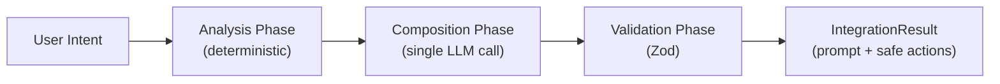
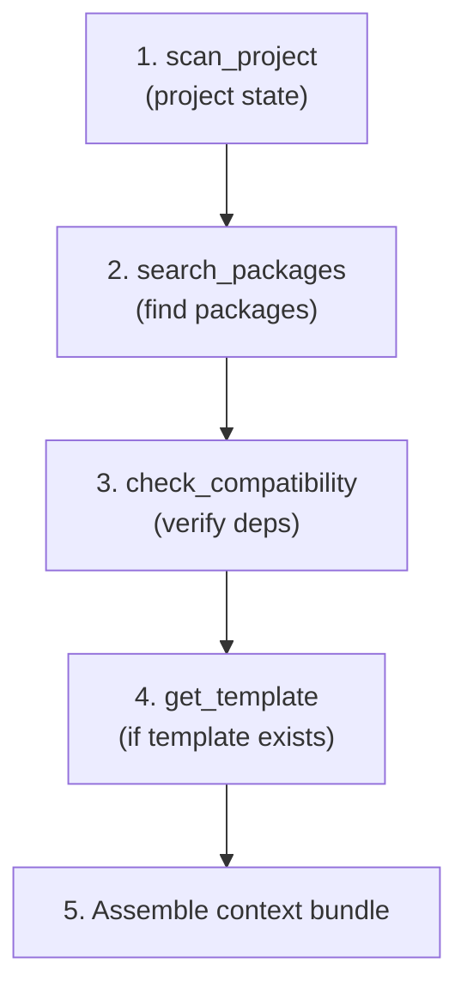
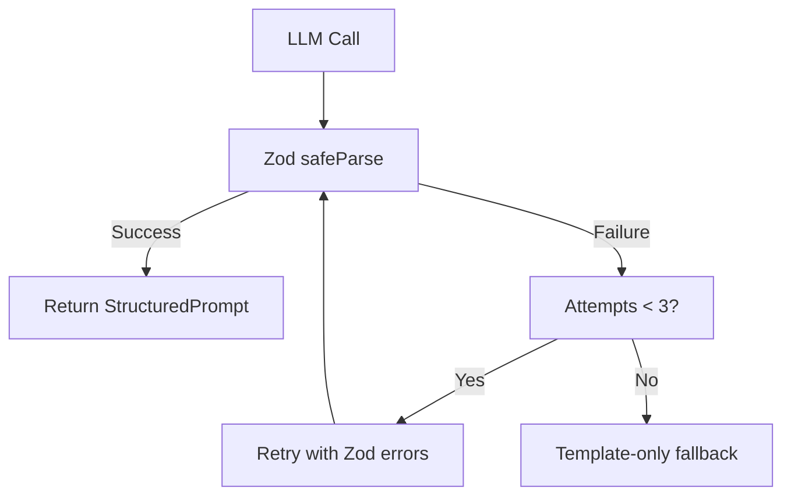
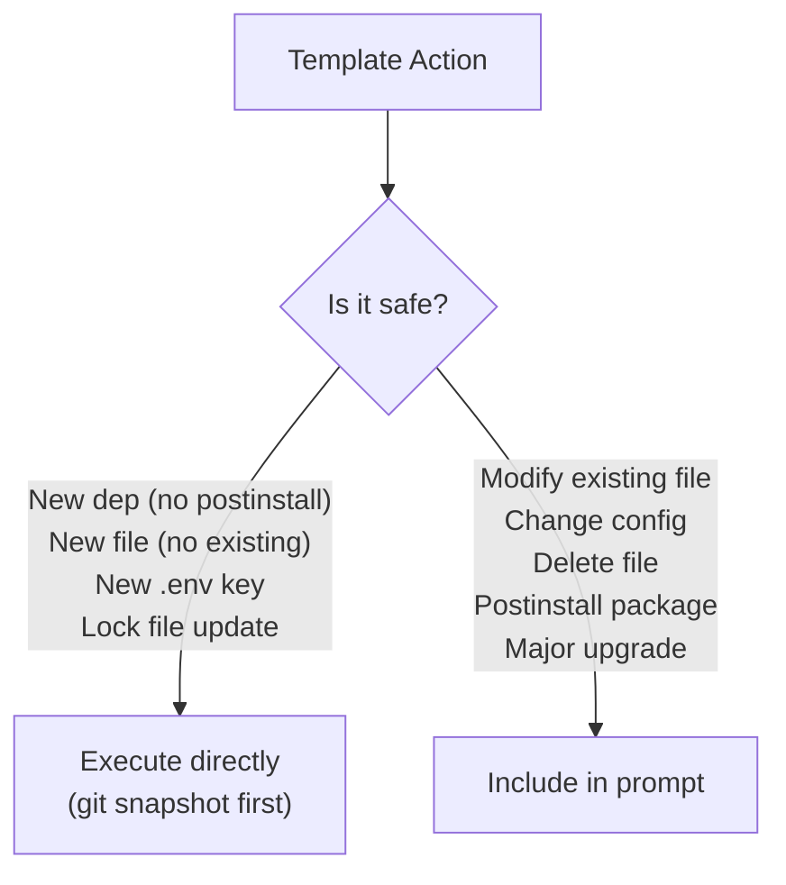

# Prompt Pipeline Specification

The prompt pipeline is the core processing flow of Vibekit. It transforms a user's intent into a structured prompt through deterministic analysis and lightweight LLM composition.

## Overview



Three phases:
1. **Analysis** — Deterministic MCP tool calls gather project context
2. **Composition** — Single LLM call composes a structured prompt from analysis results
3. **Validation** — Zod validates LLM output, with retry and fallback

## Analysis Phase

The analysis phase calls MCP tools in a **fixed, deterministic order**. No LLM decides which tools to call or in what sequence.

### Tool Call Sequence



| Step | Tool | Input | Output |
|------|------|-------|--------|
| 1 | `scan_project` | Project path | Framework, dependencies, file structure |
| 2 | `search_packages` | Service name + ecosystem | Package candidates |
| 3 | `check_compatibility` | Package + version + project deps | Compatibility result |
| 4 | `get_template` | Service + framework | Template data (or null if no template) |
| 5 | (internal) | All above results + project files | `ContextBundle` |

### Conditional Steps

- If `scan_project` detects the integration is already installed, the pipeline short-circuits with a message to the user
- If no template exists for the service + framework combination, the pipeline still proceeds — the LLM composes a prompt from package docs and analysis alone
- If `check_compatibility` finds conflicts, they're included in the prompt as warnings

### Pipeline Progress

During analysis, the agent sends `agent_thinking` messages to the UI:

```
"Scanning your project..."
"Searching for Stripe package..."
"Checking compatibility with your dependencies..."
"Loading integration template..."
"Assembling context..."
"Composing prompt..."
```

## Composition Phase

A **single LLM call** that transforms analysis results into a human-readable, structured prompt.

### LLM Inputs

The composition call includes:

1. **System prompt** — Instructions for composing integration prompts (tone, structure, what to include/exclude)
2. **Analysis results** — Serialized output from the analysis phase (framework, packages, compatibility, template)
3. **User intent** — The original natural-language request (e.g., "Add Stripe with a checkout button on the top right")
4. **Context bundle** — Relevant project file contents for the LLM to reference
5. **Template content** — If a template was found, its file definitions and configuration

### LLM Output

The LLM produces a `StructuredPrompt` (see [Prompt Schema](../schemas/prompt.md)):

```typescript
{
  id: string,
  userIntent: string,
  service: string,
  framework: string,
  content: string,         // Full rendered prompt text
  sections: [
    { type: "context", title: "Project Context", content: "..." },
    { type: "instructions", title: "Integration Steps", content: "..." },
    { type: "files", title: "Files to Create/Modify", content: "..." },
    { type: "dependencies", title: "Dependencies", content: "..." },
    { type: "configuration", title: "Configuration", content: "..." }
  ],
  analysisSummary: { ... },
  createdAt: string
}
```

### Key Constraints

- **Single call** — Not multi-turn reasoning. One input, one output.
- **Writer, not decider** — The LLM composes prose from structured data. It does not decide which tools to call or what actions to take.
- **Output is never trusted** — All output goes through Zod validation before reaching the UI.

## Validation Phase

All LLM output is validated against the `StructuredPromptSchema` using Zod.

### Validation Flow



1. **First attempt:** Call LLM, parse output with `StructuredPromptSchema.safeParse()`
2. **On failure:** Include Zod error messages in a retry call (e.g., "The `sections` field must have at least 1 item")
3. **Max 2 retries** (3 total attempts)
4. **Fallback:** After 3 failures, generate a template-only prompt — deterministic content from the template without LLM composition

### Template-Only Fallback

The fallback prompt is assembled purely from template data and analysis results:

- Context section: framework name, version, existing dependencies (from analysis)
- Instructions section: template file operations, formatted as step-by-step
- Dependencies section: packages to install (from template)
- Configuration section: environment variables needed (from template)

This ensures users **always** get a usable prompt, even if the LLM is unreachable or produces invalid output.

## Context Bundle Assembly

The context bundle selects relevant project files for inclusion in the structured prompt.

### File Selection Criteria

Files are selected based on relevance to the integration:

1. **Config files** — `package.json`, framework config (`next.config.js`, `vite.config.ts`, etc.)
2. **Files that will be modified** — Identified from the template's `files` array where `operation: "modify"`
3. **Entry points** — Main app entry, layout files, middleware
4. **Existing integration files** — Files that import related services

### Size Limits

- **Per-file limit:** 500 lines (truncated with `// ... truncated ...` marker)
- **Total bundle limit:** 50,000 characters
- **Truncation priority:** Config files and files-to-modify are prioritized; context files are truncated first

### ReferencedFile Format

Each file in the bundle includes metadata explaining why it's included:

```typescript
{
  path: "src/middleware.ts",
  content: "import { authMiddleware } from '@clerk/nextjs'...",
  reason: "Will be modified to exclude webhook route from auth",
  truncated: false
}
```

## LLM Provider Configuration

### Default: Local Model

Out of the box, Vibekit uses a local LLM (e.g., Ollama) for prompt composition. Zero API keys needed.

### Cloud Providers (Opt-in)

Users can configure cloud providers for higher quality composition:

| Provider | Config Value | Required Env Var |
|----------|-------------|-----------------|
| Local (default) | `local` | None |
| Anthropic | `anthropic` | `VIBEKIT_LLM_API_KEY` |
| OpenAI | `openai` | `VIBEKIT_LLM_API_KEY` |

### Configuration Priority

1. CLI flag: `--llm-provider`, `--llm-model`
2. Environment variable: `VIBEKIT_LLM_PROVIDER`, `VIBEKIT_LLM_API_KEY`, `VIBEKIT_LLM_MODEL`
3. Config file: `vibekit.config.json` `llm` section
4. Default: `local`

### Config File Example

```json
{
  "port": 9547,
  "llm": {
    "provider": "anthropic",
    "model": "claude-sonnet-4-5-20250929",
    "apiKey": "${VIBEKIT_LLM_API_KEY}"
  }
}
```

## Hybrid Execution Decision Tree

After the pipeline completes, each action from the template is classified:



**Safe (auto-execute):**
- Install dependencies without postinstall scripts
- Create new files where no file exists at the target path
- Add new keys to `.env.local`
- Update lock files following a safe install

**Complex (becomes prompt):**
- Modify existing source files
- Change existing config files
- Delete files
- Install packages with postinstall scripts
- Major version upgrades

See [Actions Schema](../schemas/actions.md) for full type definitions.

---

## Related Links

- [Agent Spec](./agent.md) — Pipeline integration and executor
- [Architecture](../ARCHITECTURE.md) — System-level data flow
- [Prompt Schema](../schemas/prompt.md) — StructuredPrompt and ContextBundle types
- [Actions Schema](../schemas/actions.md) — Safety classification
- [Integration Schema](../schemas/integration.md) — IntegrationResult type
- [MCP Tools API](../api/mcp-tools.md) — Tool reference for analysis phase
- [ADR-004](../adr/004-prompt-generation-over-autonomous-agent.md) — Why prompt generation over autonomous execution
